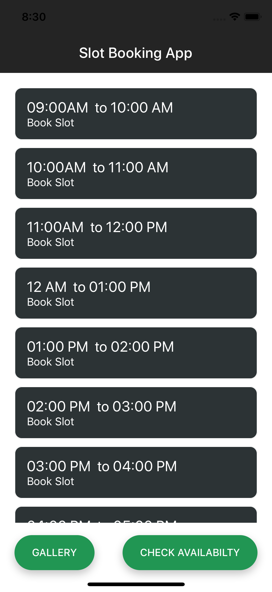
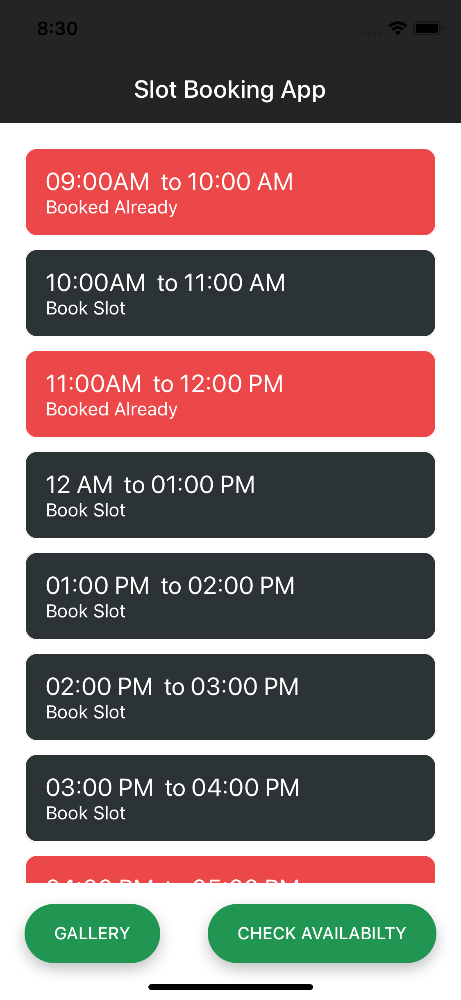
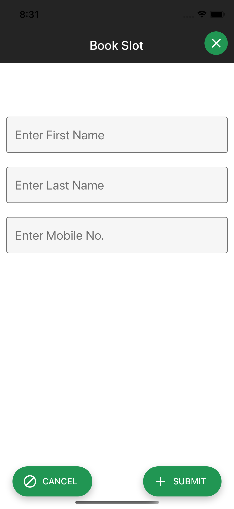
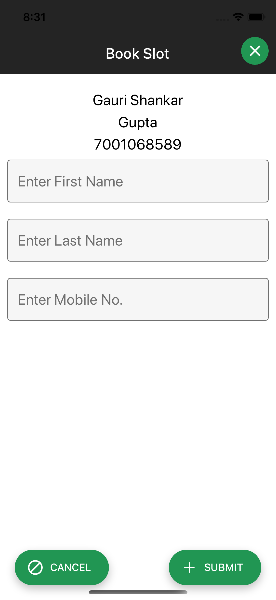

### A simple React Native App to manage booking :

## Features

-> In this app user can book their slot between 9:00 AM to 5:00 PM.
-> This app also saves previous user data if that slot is already booked inside local storage.  
-> Gallery to open photos whithin app.

## How to Operate app
-> After opening app first time Click on "CHECK AVAILABITY " to check current status of all booking slots. This step will map 
with storage if booking details is already present in local storage  . 

-> Click on any slot it will redirect to new Screen "Book Slot" where if slot is already book then 
it will display previous booking detials if not then you are good to book the current slot and also you can update these details
by clicking on same Booking slot.

-> Now Main Screen with have everything up-to-date.

## Screenshot

## Screen Recording Video
To watch video please visit on link : [Link](https://drive.google.com/file/d/12akhK3JVmP0HWwV63iUHmEnL0VDt1u7f/view?usp=sharing)

## How to run this app locally on your device

First Clone this project:
Install all required npm using "npm install command"

### `npm start`

To run on android device press "a" or iOS device press "i".

Now you can access your app on your respective devices.

